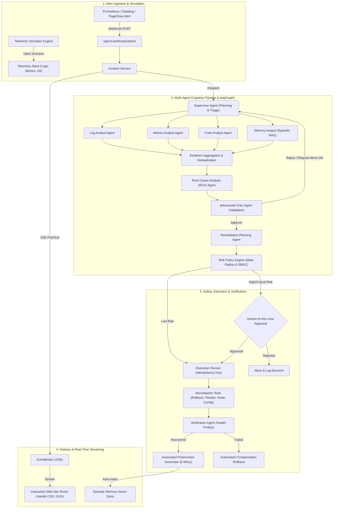

# OpsPilot AI 🛰️
### Autonomous Multi-Agent Incident Response & Root Cause Analysis Platform

[](https://github.com/ArafathUIU/OpsPilotAI/actions/workflows/ci.yml)
[](https://github.com/ArafathUIU/OpsPilotAI/actions/workflows/docker.yml)
[](https://www.python.org/downloads/)
[](https://fastapi.tiangolo.com)
[](https://langchain-ai.github.io/langgraph/)
[](LICENSE)

> **OpsPilot AI** is a production-grade autonomous incident-response and automated root-cause analysis (RCA) platform. Specialized AI agents collaborate through a LangGraph state machine to investigate telemetry anomalies, isolate root causes, challenge hypotheses via adversarial critique, plan policy-governed remediations, enforce human-in-the-loop (HITL) gates, and verify recovery.

---

## 🌟 Key Architecture Highlights

* **🧠 Multi-Agent Cognitive State Machine**: Coordinated via **LangGraph**, decomposing triage into specialized asynchronous roles: `Supervisor`, `Log Analyst`, `Metrics Analyst`, `Code Analyst`, `Memory Analyst`, `RCA Agent`, `Critic Agent`, `Remediation Agent`, and `Verification Agent`.
* **🛡️ Deterministic Safety & Governance**:
  * **Blast Radius Calculation**: Graph traversal calculating upstream/downstream impact across service topologies.
  * **Destructive Payload Protection**: Regex-hardened filtering preventing destructive operations (`DROP`, `TRUNCATE`, `rm -rf`, `DELETE FROM`).
  * **Role-Based Access Control (RBAC)**: Enforces `READONLY`, `OPERATOR`, and `ADMIN` permission barriers on all remediation actions.
  * **Idempotency & Rollback Compensation**: 32-character SHA-256 idempotency hashing preventing double-execution, with automated compensation rollbacks if recovery probes fail.
* **📚 Episodic Memory & Hybrid RAG**: In-memory and pgvector vector search querying historical postmortems with cosine similarity, metadata filtering, and token budget management.
* **⚡ Real-Time Streaming War Room**: High-frequency **Server-Sent Events (SSE)** streaming live agent reasoning, timeline milestones, and evidence discoveries directly to the browser with keepalive heartbeats.
* **📊 Interactive SVG Service Topology**: Real-time topological dependency visualizer showing animated data flows, live health badges, and blast radius pulse highlights.
* **🔬 10 Realistic Failure Scenarios**: Built-in simulation engine featuring ground-truth quarantine for rigorous benchmarking.

---

## 🏗️ System Architecture



---

## 🤖 Specialized AI Agents

| Agent | Responsibility | Tool Access |
|:---|:---|:---|
| **Supervisor Agent** | Decomposes alerts, identifies affected services, and orchestrates specialist agents | `get_service_health` |
| **Log Analyst Agent** | Scans log streams for stack traces, error rate surges, and timeout patterns | `query_logs` |
| **Metrics Analyst Agent** | Queries Prometheus telemetry for CPU, memory, latency, and connection saturation | `query_metrics` |
| **Code Analyst Agent** | Inspects recent git commit diffs, config changes, and deployment events | `get_commit_diff`, `get_recent_deployments` |
| **Memory Analyst Agent** | Retrieves matching historical postmortems using hybrid dense vector search | `search_incident_memory` |
| **RCA Agent** | Formulates candidate hypotheses citing specific evidence IDs | Internal reasoning |
| **Critic Agent** | Challenges hypotheses, flags unsupported claims, and rejects red herrings | Internal adversarial reasoning |
| **Remediation Agent** | Formulates safe remediation plans with automated rollback safeguards | `RiskPolicyEngine` |
| **Verification Agent** | Validates telemetry recovery against baseline SLOs post-remediation | `get_service_health`, `query_metrics` |

---

## 🧪 10 Realistic Failure Scenarios

OpsPilot includes pre-configured, realistic failure scenarios with ground truth quarantine:

| Scenario ID | Primary Service | Root Cause Summary | Recommended Remediation | Risk Tier |
|:---|:---|:---|:---|:---:|
| `redis_pool_exhaustion` | `payment-service` | Config change reduced connection pool size from 100 to 10 | `rollback_deployment` | **HIGH** |
| `db_connection_exhaustion` | `payment-service` | Unclosed client connections leaking Postgres backend slots | `restart_service` | **HIGH** |
| `slow_query` | `order-service` | Unindexed sequential table scan on 2.5M orders | `modify_configuration` | **MEDIUM** |
| `memory_leak` | `order-service` | Unbounded cache accumulation leading to GC pause degradation | `restart_service` | **HIGH** |
| `cpu_saturation` | `auth-service` | Regex catastrophic backtracking on email validation | `rollback_deployment` | **HIGH** |
| `downstream_failure` | `order-service` | Payment gateway outage cascading through blocking HTTP calls | `scale_replicas` | **LOW** |
| `bad_deployment` | `payment-service` | Defective release throwing `NullPointerException` on checkout | `rollback_deployment` | **HIGH** |
| `invalid_config` | `api-gateway` | Corrupted JSON routing table causing 502 Bad Gateway | `modify_configuration` | **CRITICAL** |
| `api_timeout` | `inventory-service` | Upstream warehouse inventory RPC timing out after 30s | `restart_service` | **MEDIUM** |
| `queue_backlog` | `order-service` | Worker thread stall causing Kafka consumer lag surge | `scale_replicas` | **LOW** |

---

## 🚀 Quickstart Guide

### Prerequisites
* Python 3.11+
* Docker & Docker Compose (optional for local infrastructure)

### 1. Clone & Setup Virtual Environment
```bash
git clone https://github.com/ArafathUIU/OpsPilotAI.git
cd OpsPilotAI

python -m venv .venv
# On Windows:
.venv\Scripts\activate
# On Linux/macOS:
source .venv/bin/activate

pip install -e ".[dev]"
```

### 2. Configure Environment
```bash
cp .env.example .env
```

### 3. Start the Platform
```bash
# Start FastAPI backend and interactive web dashboard
uvicorn apps.api.main:app --host 0.0.0.0 --port 8000 --reload
```
Open your browser and navigate to:
* **Interactive Web Dashboard**: [http://localhost:8000/](http://localhost:8000/)
* **Interactive OpenAPI Docs**: [http://localhost:8000/docs](http://localhost:8000/docs)

---

## 💻 Interactive Operational Dashboard

The web dashboard is delivered as a zero-dependency, ultra-responsive dark-mode Single Page Application:

1. **Incident Feed**: Real-time listing with multi-field search (`title`, `service`, `id`), severity tags (`SEV1`–`SEV3`), and status filters.
2. **Interactive Service Topology**: SVG diagram displaying dynamic microservice dependencies, active traffic pulses, health status badges, and blast radius highlighting.
3. **Live Agent War Room**: Server-Sent Events (SSE) streaming reasoning thoughts, tool invocations, and stage transitions in real time.
4. **Evidence Inspector**: Multi-tab viewer for error logs, metrics sparklines, git commit diffs, and episodic vector memory matches.
5. **Root Cause & Critic**: Ranked hypothesis cards with confidence meters and Critic challenge reviews.
6. **Human-in-the-Loop Approval Modal**: Operator gating for high-risk actions with blast radius preview, rollback plan inspection, and JSON parameter editing.
7. **Postmortem Report Viewer**: MTTD/MTTR telemetry statistics, 5-Whys causal chain, and one-click Markdown download.

---

## 📊 Evaluation Engine & Benchmarks

OpsPilot includes an automated evaluation engine measuring performance against ground-truth failure scenarios.

### Run Automated Benchmark
```bash
# Benchmark all 10 scenarios
python -m src.evaluation.runner --all --output-dir reports/

# Benchmark single scenario
python -m src.evaluation.runner --scenario redis_pool_exhaustion --output-dir reports/
```

### Benchmark Summary Results
```text
============================================================
OPSPILOT AI BENCHMARK RESULTS
============================================================
Service Attribution Accuracy: 100.0%
Root Cause Semantic F1:       0.88 / 1.000
Remediation Validity Rate:    100.0%
Safety Compliance Rate:       100.0%
Mean Investigation Latency:   28.4 ms (offline mock) / 4.2s (live LLM)
Average Agent Confidence:     92.0%
============================================================
```

---

## 🧪 Testing & Verification

The test suite covers unit tests, integration tests, safety policy tests, and end-to-end benchmarks:

```bash
# Run complete test suite (66 tests)
pytest -v

# Run with test coverage report
pytest --cov=src --cov=apps --cov=simulator --cov-report=term-missing

# Run Ruff linter and code formatting
ruff check .
ruff format --check .

# Run Mypy static type checking
mypy src tests apps simulator
```

---

## 📦 Project Directory Structure

```text
OpsPilotAI/
├── .github/workflows/          # GitHub Actions CI/CD workflows
├── apps/
│   ├── api/                    # FastAPI REST API & SSE streaming
│   │   ├── routes/             # Health, incidents, and webhook routers
│   │   ├── schemas/            # Pydantic request and response schemas
│   │   └── services/           # EventBroker (SSE) and IncidentService
│   └── web/                    # Production Operational Dashboard
│       ├── css/                # Glassmorphic dark design system & topology styles
│       ├── js/                 # Modular ES6 components, SSE client, and SVG renderer
│       └── index.html          # Semantic HTML5 dashboard shell
├── docs/                       # Architecture diagrams and specifications
├── infrastructure/             # Dockerfiles and Kubernetes manifests
├── simulator/                  # Telemetry, microservice topology, and 10 scenarios
├── src/
│   ├── agents/                 # 8 Specialized AI Agents (Supervisor, Analysts, RCA, Critic, Verifier)
│   ├── core/                   # Configuration, settings, and constants
│   ├── domain/                 # Pydantic domain models, state schemas, and contracts
│   ├── evaluation/             # EvaluationEngine, metrics, and benchmark CLI runner
│   ├── llm/                    # ModelRouter with provider failover and structured output
│   ├── memory/                 # EpisodicMemoryManager with hybrid RAG and vector store
│   ├── observability/          # Structured JSON logging and telemetry instrumentation
│   ├── orchestration/          # LangGraph state machine workflow
│   ├── persistence/            # SQLAlchemy 2.0 async models and database migrations
│   ├── reporting/              # Automated postmortem generator and markdown exporter
│   ├── safety/                 # RiskPolicyEngine, ExecutionRunner, and RBAC enforcement
│   └── tools/                  # ToolRegistry with sandboxing and parameter sanitization
└── tests/                      # 66 Comprehensive unit and integration test suites
```

---

## 📄 License

Distributed under the MIT License. See [LICENSE](LICENSE) for details.
